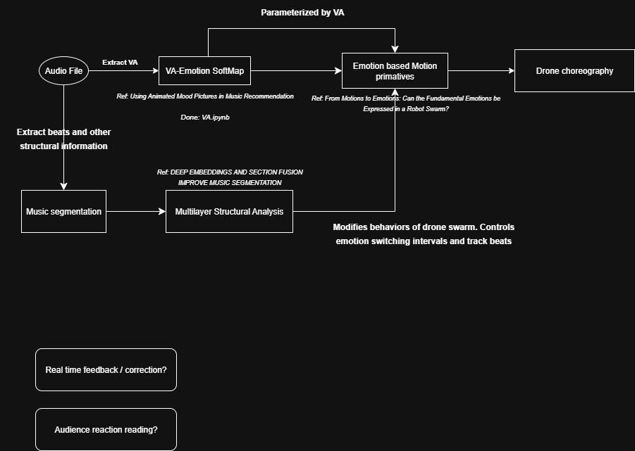

# Musical Drone


## Pipeline

This pipeline is subjected to change

## Valence-arousal to Emotion
This part is implemented in
```va.ipynb```

## segmentation
the structural segmentation is done using the models from the following github repo. Detailed instruction could be found in https://github.com/justinsalamon/musicseg_deepemb

The beat tracking uses librosa's beat track function

```t
@inproceedings{Salamon:Segmentation:ISMIR:2021,
	Author = {J. Salamon and O. Nieto and N.J. Bryan},
	Booktitle = {Proc.~22nd International Conference on Music Information Retrieval (ISMIR)},
	Month = {Nov.},
	Title = {Deep Embeddings and Section Fusion Improve Music Segmentation},
	Year = {2021}}
```

## Current challenges

- not quite enough emotional shiftings to make the choreography interesting, especially for sad emotions (it's just spinning in circles)
- 

## Todo list

- Design 3d motion primatives
- use beat tracking information to control overall speed of motion primatives


