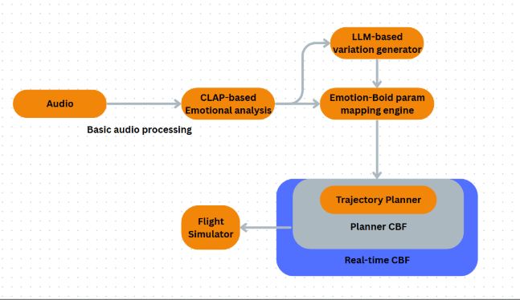
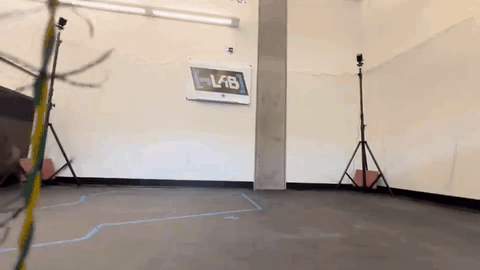
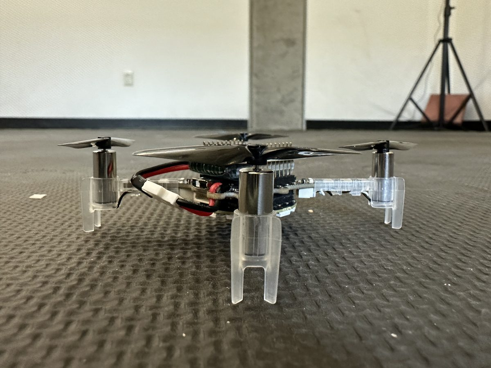
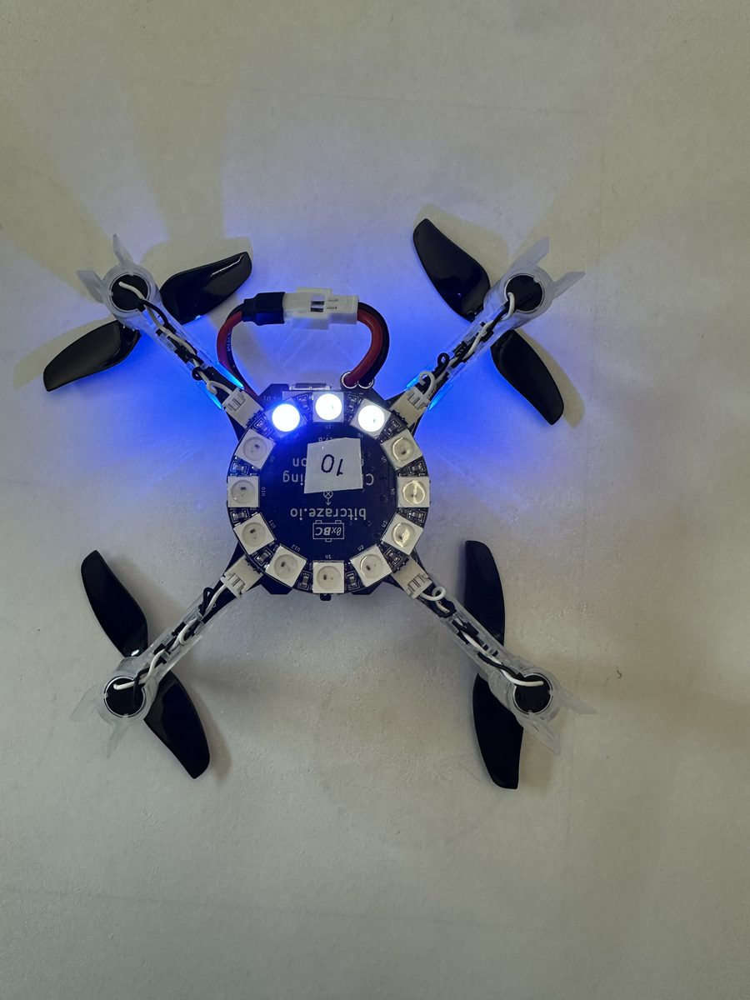

# Musical Drone

### A music-to-motion pipeline for expressive drone swarm choreography

Musical Drone is a research-oriented tool for artists, roboticists, and creative technologists who want to turn a song into expressive drone swarm motion and LED cues.

Drone choreography for music-based performance is usually time-consuming to author by hand, especially when motion, lighting, musical timing, and safety constraints all need to agree. This project reduces that manual burden by translating beat-aligned musical descriptors into swarm behavior, giving creators a faster way to sketch emotionally responsive drone performances while preserving a robotics pipeline that can be inspected and adapted.

The current system analyzes music in beat-aligned segments, classifies each segment against affective audio labels, maps the resulting weights onto swarm-control parameters, and generates trajectory CSV output for visualization or Crazyflie-based execution. Optional language-model components add a compact phrase-level plan that can steer a shared attractor while leaving low-level trajectory generation and safety filtering to the robotics stack.

## How to test

0. make sure you have all the dependencies by doing ```pip install requirements.txt```
1. put your song in mp3 form into /audio
2. put your llm key into .env
3. ```./pipeline.sh --audio SONGNAME.mp3 --output trajectories.csv --llm --phrase-plan```
4. ```make trajectories -C visuals```
5. ```DRONE_JSON_DIR=data/SONGNAME.mp3/json ./visuals/traj > data/SONGNAME.mp3/trajectory.csv```


*Figure: the system architecture starts with audio processing, uses CLAP to estimate segment-level musical affect, optionally expands labels with an LLM variation generator, maps emotion weights into boids-control parameters, and sends the result through a trajectory planner. The generated trajectory uses planner-level CBF in the C++ simulation path; hardware playback through `monitor_CBF.py` adds a separate real-time CBF layer.*

## Demo



*Demo preview: five Crazyflie drones flying inside a protected indoor flight cage during a hardware test.*

Watch or download the full MP4: [five-drone flight demo](demo/5dronesdemo.mp4?raw=true)

### Hardware


*Figure: Crazyflie quadcopter used for hardware testing inside the protected flight space.*


*Figure: Crazyflie light ring deck used for emotion-synchronized LED cues.*

## Highlights

- **Start from music without hand-authored waypoints.** Provide an audio file and generate a timed trajectory CSV that follows beat-aligned musical segments.
- **Shape motion with interpretable affective labels.** The system maps music descriptors into emotion-anchor weights so creators can inspect why a segment changes the swarm behavior.
- **Coordinate movement and lights from the same timing source.** Crazyflie LED cues use the same segment timing as the generated motion, so color changes can align with musical transitions.
- **Experiment safely before hardware.** The C++ trajectory generator includes workspace bounds, speed and acceleration caps, and OSQP-backed CBF filtering before trajectories are sent to real drones.
- **Add phrase-level direction when needed.** Optional LLM planning can add a compact attractor plan for larger musical phrases while preserving deterministic low-level simulation and safety filtering.

## Try It

View the project on GitHub: [github.com/Niagui/MusicalDrone](https://github.com/Niagui/MusicalDrone)

Generate a trajectory from one of the included testing audio files:

```bash
./pipeline.sh --audio testSong.mp3 --output trajectories.csv
```

Minimum setup: Python 3.10+, a C++17 compiler, and a built OSQP library under `visuals/osqp/osqp`. The full setup commands are listed in [Installation](#installation).

Platform notes:

- CLAP analysis can run on CPU, but GPU support is used automatically when available.
- The Essentia valence-arousal utility in `src/valence_arousal.py` is not part of the default pipeline and is easiest to run on Linux or macOS.
- Crazyflie execution requires compatible Crazyflie hardware, radio configuration, local URI updates, and a safe flight space.

## Research Context

This repository is positioned as a technology-and-code contribution for expressive robotics. Its framing is compatible with art-robot research themes such as common language, collaboration between artists and roboticists, and the design of interpretable motion vocabularies. In particular, the project treats musical descriptors such as mood, valence, arousal, tension, phrase role, and motion mode as intermediate representations between a musical work and a robotic swarm.

## Current Pipeline

The main reproducible path is implemented in `pipeline.sh`. It generates cached analysis artifacts and a trajectory CSV:

```text
audio file
  -> basic audio processing
  -> CLAP-based emotional analysis
  -> optional LLM-based label variation
  -> emotion-to-boid parameter mapping
  -> trajectory planner with planner CBF
  -> trajectory CSV for simulation or Crazyflie playback
```

The real-time CBF layer shown in the architecture diagram is part of the hardware execution path in `monitor_CBF.py`, not a step that `pipeline.sh` runs directly.

Run the default pipeline:

```bash
./pipeline.sh --audio testSong.mp3 --output trajectories.csv
```

Run with optional LLM-assisted label variation and phrase planning:

```bash
./pipeline.sh --audio testSong.mp3 --output trajectories.csv --llm
```

Skip the evaluation stage when only the trajectory is needed:

```bash
./pipeline.sh --audio testSong.mp3 --output trajectories.csv --no-eval
```

Generated artifacts are stored per audio file under:

```text
data/<audio-file>/json/
data/<audio-file>/trajectory.csv
data/<audio-file>/evaluation/
```

The `DRONE_JSON_DIR` environment variable is used internally so each audio run can read and write isolated JSON artifacts.

## Architecture

### Audio Analysis

`src/beat_track.py` uses `librosa` to estimate beat times and group them into fixed-size phrase windows. These windows become the time base for downstream CLAP analysis and are saved as `beat_times.json` and `k_beat_segments.json`.

`src/clap.py` wraps the LAION CLAP model (`laion/larger_clap_general`) through Hugging Face Transformers. For each beat-aligned segment, the system performs zero-shot audio classification over labels in `json/clap_labels.json`, then compares selected label embeddings against anchor emotions in `json/anchor_labels.json`.

`src/main.py` coordinates the analysis stage. It reuses cached `clap_results.json` when available, computes emotion-anchor weights, and writes `clap_weights.json`, the core interface consumed by the trajectory generator and lighting controller.

### Optional Language Layer

The LLM components are optional and only run when requested with `--llm`.

`src/label_variations_generator.py` reads cached CLAP segment labels and generates near-synonym mood variations in `llm_weights.json`. `src/main.py --use-llm` can then fold the strongest variation back into the CLAP embedding workflow.

`src/phrase_generator.py` creates `phrase_plan.json`, a compact single-attractor plan with fields such as `section_role`, `motion_mode`, `height_level`, `depth_level`, `speed_level`, `vertical_trend`, and a heuristic `beat_plan`. If no OpenAI API key is available, the phrase planner falls back to default phrase records rather than stopping the pipeline.

### Motion Generation

`visuals/simulateBoids.cpp` produces the trajectory CSV used by the pipeline. It initializes formation targets, advances the simulation at 60 Hz, and writes sampled drone states every 0.2 seconds.

`visuals/boids.cpp` contains the expressive swarm model. It loads `clap_weights.json`, maps emotion weights to boids parameters, applies phrase-attractor offsets when `phrase_plan.json` is available, and updates positions using separation, alignment, cohesion, goal seeking, altitude control, and jitter. The emotion anchors currently represented in the C++ parameter table are:

```text
happy, sad, sleepy, brave, grumpy, scared, shy
```

`visuals/config.h` centralizes drone count, workspace bounds, speed/acceleration caps, and CBF configuration.

### Safety Filtering

`visuals/cbf_solver.cpp` and `visuals/cbf_solver.h` implement an OSQP-backed control barrier function filter for the simulated trajectory generator. The solver constrains velocity, acceleration, workspace boundaries, and inter-drone separation, with bounded slack for limited recovery when constraints conflict.

`monitor_CBF.py` includes a separate Python-side CBF safety filter for Crazyflie execution. It uses live telemetry to adjust commanded waypoint targets, logs waypoint decisions to `logs/actual_waypoints.log`, monitors timing and CBF compute cost, and provides emergency-landing behavior.

### Hardware and Lighting

`lights.py` reads `clap_weights.json` and maps the dominant emotion index to RGB values for Crazyflie LED rings. Lighting threads wait for the shared sequence start time published by `monitor_CBF.py`, allowing motion, audio, and lights to start from the same clock.

`monitor_CBF.py` is the more complete hardware execution script. It loads `trajectories.csv`, starts telemetry logging, synchronizes takeoff, starts audio playback with a lead window, applies the Python CBF filter during waypoint execution, coordinates LED timing, and attempts safe shutdown on interruption.

`crazyflies.py` is a simpler waypoint playback script and is kept as a lightweight Crazyflie example, but the synchronized CBF, audio, lighting, and logging workflow is implemented in `monitor_CBF.py`.

## Repository Layout

```text
audio/                  sample audio files
data/                   per-audio generated JSON and trajectory output
json/                   shared labels, anchor definitions, and example artifacts
src/                    Python audio analysis and optional LLM planning
visuals/                C++ boids simulation, trajectory generator, and CBF solver
tests/                  unit tests for analysis, phrase planning, lighting, and logging
demo/                   videos, animation, and pipeline diagram
models/                 Essentia/TensorFlow valence-arousal model files
notebook/               exploratory notebooks
```

## Installation

Python 3.10 or newer is expected by `pyproject.toml`.

```bash
python3 -m venv .venv
source .venv/bin/activate
pip install -r requirements.txt
pip install -r requirements-dev.txt
```

The trajectory generator also requires a C++17 compiler and OSQP. The repository contains OSQP source under `visuals/osqp/osqp`; if it has not been built on your machine, build it before running `make trajectories`:

```bash
cd visuals
cd osqp
git clone --recurse-submodules https://github.com/osqp/osqp.git
mkdir -p build && cd build

cmake .. -DCMAKE_BUILD_TYPE=Release -DBUILD_SHARED_LIBS=ON -DOSQP_BUILD_TESTS=OFF
cmake --build . -j
```
Then make a copy of the osqp_configure.h file here: https://github.com/Gepetto/quadruped-reactive-walking/blob/main/include/osqp_folder/include/osqp_configure.h
and add it to visuals/osqp/osqp/include/public

Then compile the trajectory generator:

```bash
make trajectories -C visuals
```

For LLM-assisted runs, set `OPENAI_API_KEY` in the environment or in a local `.env` file. The phrase generator can still produce default records without a key, but label variation generation requires one.

## Usage

Generate a trajectory for a file in `audio/`:

```bash
./pipeline.sh --audio intenseSpanish.mp3 --output trajectories.csv
```

Generate a trajectory for an arbitrary file path:

```bash
./pipeline.sh --audio /path/to/song.mp3 --output trajectories.csv
```

Use descriptor-anchor mode when CLAP's raw emotion labels are too literal or
unstable:

```bash
./pipeline.sh --audio clairedelune.mp3 --descriptor-anchors --output trajectories.csv
```

Descriptor-anchor mode reads `json/descriptor_anchor_config.json` by default.
Pass `--anchor-config path/to/config.json` to define custom anchor emotions and
their descriptor prompts.

Use generated artifacts from a specific output directory:

```bash
./pipeline.sh --audio testSong.mp3 --cache-root data --output trajectories.csv
```

Run the Python analysis stage only:

```bash
python3 src/main.py --audio testSong.mp3 --prepare-only
```

Execute a generated trajectory on Crazyflie hardware:

```bash
python3 monitor_CBF.py
```

Before hardware execution, update the Crazyflie URIs, audio path, workspace bounds, and trajectory path in `monitor_CBF.py` for the local setup.

## Testing

Run the unit test suite:

```bash
pytest
```

The tests cover beat tracking, JSON path behavior, phrase-planner normalization and fallback behavior, lighting-thread timing, and safety/logging behavior in the monitor module.

## Implemented vs. Exploratory Components

Implemented in the active pipeline:

- Beat tracking and k-beat segmentation through `src/beat_track.py`
- CLAP-based audio labeling and emotion-anchor weighting through `src/main.py` and `src/clap.py`
- Optional LLM label variation and phrase planning through `pipeline.sh --llm`
- Boids-based trajectory generation through `visuals/simulateBoids.cpp` and `visuals/boids.cpp`
- OSQP-backed CBF filtering in the C++ trajectory generator
- Crazyflie waypoint playback, telemetry logging, lighting synchronization, audio playback, and Python CBF filtering in `monitor_CBF.py`

Exploratory or supporting components:

- `src/valence_arousal.py` contains an Essentia-based valence-arousal predictor and visualization utilities, but it is not called by `pipeline.sh`.
- `src/segment.py` and the notebooks document structural segmentation experiments using `musicseg_deepemb`, but the current pipeline path uses beat grouping rather than that script.
- `barrier_functions.py` contains a standalone CVXPY safety-control prototype separate from the active C++ and monitor CBF implementations.

## Demonstrations

Local demo assets are included in `demo/`, including simulation media and hardware attempts:

- `demo/5dronesdemo.mp4`
- `demo/5dronesdemo.gif`
- `demo/crazyflies.jpg`
- `demo/lightring.jpg`
- `demo/swarm_animation.gif`
- `demo/VA_on_2d_plane.gif`
- `demo/drones.mp4`
- `demo/demo video 2 drones attempt.mp4`
- `demo/demo video emergancy stop.mp4`

These files demonstrate development artifacts in the repository. They are not presented here as formal evaluation results.

## Team and Acknowledgements

Project contributors listed in the package metadata:

- Gordon Shum, CLAP/audio analysis
- Henry James, language-model planning
- Lydia Brown, boids simulation and visualization

Mentorship and academic context noted in the previous project documentation:

- Dr. Nicole Fronda, Department of EECS, Oregon State University
- Dr. Houssam Abbas, Assistant Professor of EECS, Oregon State University 

Feedback and issues: please use [GitHub Issues](https://github.com/Niagui/MusicalDrone/issues).

The structural segmentation experiments reference the `musicseg_deepemb` project and its ISMIR 2021 paper:

```bibtex
@inproceedings{Salamon:Segmentation:ISMIR:2021,
  Author = {J. Salamon and O. Nieto and N.J. Bryan},
  Booktitle = {Proc. 22nd International Conference on Music Information Retrieval (ISMIR)},
  Month = {Nov.},
  Title = {Deep Embeddings and Section Fusion Improve Music Segmentation},
  Year = {2021}
}
```

## License

See `LICENSE` for repository licensing terms.
